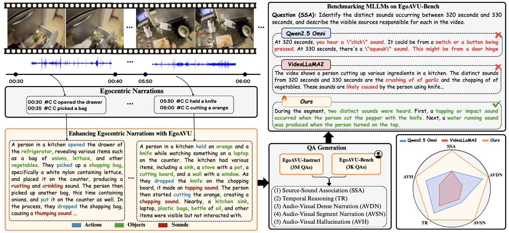
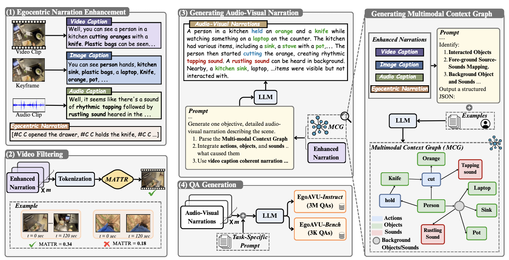
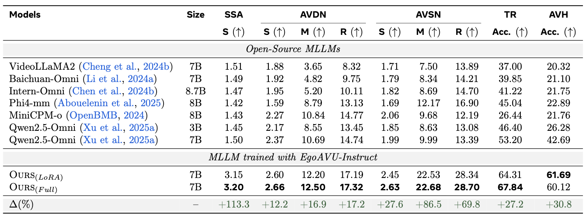
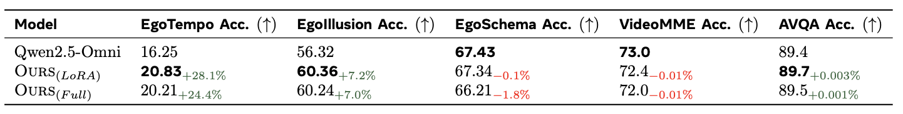
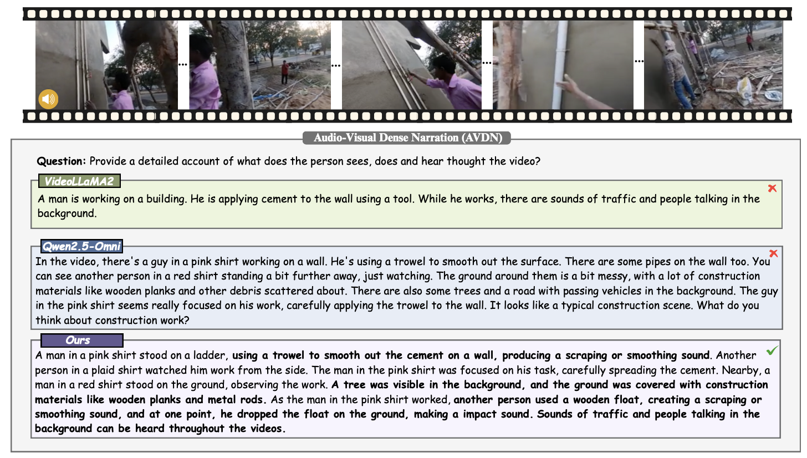

# [CVPR2026] EgoAVU
Official Implementatation of **EgoAVU: Egocentric Audio-Visual Understanding**

<a href='https://arxiv.org/abs/2602.06139'>[Paper]</a> <a href='https://cs20s030.github.io/EgoAVU/'>[Project Page]</a> <a href='https://huggingface.co/datasets/facebook/EgoAVU_data'>[Huggingface Dataset]</a>

We introduce EgoAVU, a scalable and automated data engine to enable egocentric audio–visual understanding. EgoAVU enriches existing egocentric narrations by integrating human actions with environmental context, explicitly linking visible objects and the sounds produced during interactions or surroundings. Leveraging this pipeline, we construct EgoAVU-Instruct (3M QAs) and EgoAVU-Bench (3K verified QAs), enabling systematic training and evaluation of Multimodal Large Language Models (MLLMs). Models finetuned with EgoAVU-Instruct exhibit high audio-visual grounding in egocentric settings.


<div align=center>

</div>

## Citation

    If you find our code useful for your research, please consider citing:
@article{seth2026egoavu,
  title={EgoAVU: Egocentric Audio-Visual Understanding},
  author={Seth, Ashish and Mei, Xinhao and Zhao, Changsheng and Nagaraja, Varun and Chang, Ernie and Meyer, Gregory P and Lan, Gael Le and Xiong, Yunyang and Chandra, Vikas and Shi, Yangyang and others},
  journal={arXiv preprint arXiv:2602.06139},
  year={2026}
}


## Steps to run EgoAVU

<div align=center>

</div>

The EgoAVU data engine pipeline consists of 5 stages that transform raw egocentric videos into rich audio-visual QA pairs. Use the `run_pipeline.sh` script to execute the complete pipeline or individual stages.

### Pipeline Overview

| Stage | Description | Output |
|-------|-------------|--------|
| **1. Split Videos** | Split video+audio into 10-second segments | Split video files + CSV with paths |
| **2. Generate Captions** | Generate video, sound, and object descriptions using Qwen2.5-Omni and Qwen2.5-VL | JSONL with multimodal captions |
| **3. Generate MCG** | Create Multimodal Context Graph linking objects and sounds | JSONL with scene graphs |
| **4. Generate AV Narration** | Combine MCG with captions to create unified narration | JSONL with combined narrations |
| **5. Generate QA Pairs** | Generate QA pairs for 7 different task types | JSONL files per QA type |

### Input Data Format

Prepare a CSV file with video information (see `utils/sample_vid.csv` for reference):

```csv
id,start_time,end_time,split
video_uuid_1,0,360,train
video_uuid_2,360,720,train
```

- `id`: Video filename (without extension)
- `start_time`: Start timestamp in seconds
- `end_time`: End timestamp in seconds
- `split`: Data split (train/val/test)

### Running the Pipeline

#### Run Complete Pipeline

```bash
./run_pipeline.sh --all
```

#### Run Individual Stages

```bash
# Stage 1: Split videos into segments
./run_pipeline.sh --split

# Stage 2: Generate captions using Qwen2.5-Omni
./run_pipeline.sh --caption

# Stage 3: Generate Multimodal Context Graph (MCG)
./run_pipeline.sh --mcg

# Stage 4: Generate combined audio-visual narration
./run_pipeline.sh --av-narration

# Stage 5: Generate QA pairs for all task types
./run_pipeline.sh --qa
```

#### Resume from a Specific Stage

```bash
# Resume from MCG generation (runs stages 3, 4, 5)
./run_pipeline.sh --from-mcg

# Resume from AV narration (runs stages 4, 5)
./run_pipeline.sh --from-av
```

### Configuration

Configure the pipeline using environment variables:

#### Path Configuration

| Variable | Default | Description |
|----------|---------|-------------|
| `CSV_FILE` | `./utils/sample_vid.csv` | Input CSV with video metadata |
| `INPUT_VIDEO_DIR` | `./media/input` | Directory containing source videos |
| `SPLIT_OUTPUT_DIR` | `./media/split` | Output directory for split segments |
| `CAPTION_OUTPUT_DIR` | `./outputs/captions` | Output directory for captions |
| `MCG_OUTPUT_DIR` | `./outputs/mcg` | Output directory for MCG |
| `AV_NARRATION_OUTPUT_DIR` | `./outputs/av_narration` | Output directory for AV narrations |
| `QA_OUTPUT_DIR` | `./outputs/qa` | Output directory for QA pairs |

#### Model Configuration

| Variable | Default | Description |
|----------|---------|-------------|
| `QWEN_MODEL_PATH` | `Qwen/Qwen2.5-Omni-7B` | Path to Qwen model for caption generation |
| `LLM_MODEL_ID` | `meta-llama/Meta-Llama-3-70B` | LLM for MCG, narration, and QA generation |

#### Processing Parameters

| Variable | Default | Description |
|----------|---------|-------------|
| `NUM_GPUS` | `4` | Number of GPUs for distributed processing |
| `CHUNK_DURATION` | `10.0` | Duration of video segments in seconds |
| `BATCH_SIZE` | `64` | Batch size for caption generation |
| `SPLIT_WORKERS` | `4` | Parallel workers for video splitting |
| `MAX_NEW_TOKENS` | `512` | Maximum tokens for LLM generation |
| `TEMPERATURE` | `0.7` | Sampling temperature for LLM |

### Example with Custom Configuration

```bash
CSV_FILE=./my_data/videos.csv \
INPUT_VIDEO_DIR=./my_data/raw_videos \
NUM_GPUS=8 \
LLM_MODEL_ID=meta-llama/Meta-Llama-3-70B \
./run_pipeline.sh --all
```

### QA Task Types

The pipeline generates QA pairs for 7 different audio-visual understanding tasks:

| Task | Prompt File | Description |
|------|-------------|-------------|
| **AVDN** | `prompt_avdn.txt` | Dense narration summarizing the entire video |
| **AVH-Action** | `prompt_avh_action.txt` | Hallucination detection for actions |
| **AVH-Object** | `prompt_avh_object.txt` | Hallucination detection for objects |
| **AVH-Sound** | `prompt_avh_sound.txt` | Hallucination detection for sounds |
| **SSA** | `prompt_ssa.txt` | Sound-source association reasoning |
| **TR-Before/After** | `prompt_tr_before_after.txt` | Temporal reasoning about event order |
| **TR-Event Ordering** | `prompt_tr_event_ordering.txt` | Temporal reasoning about event sequences |

## Training

We use [LlamaFactory](https://github.com/hiyouga/LLaMA-Factory) for all training experiments.

### Setup

1. Install LlamaFactory following their [official installation guide](https://github.com/hiyouga/LLaMA-Factory#installation)
2. Use the provided configuration files for training:
   - **LoRA fine-tuning**: `.train/qwen2_5omni_lora_sft.yml`
   - **Full fine-tuning**: `.train/qwen2_5omni_full_sft.yml`

### Run Training
```bash
# LoRA fine-tuning
llamafactory-cli train .train/qwen2_5omni_lora_sft.yml

# Full fine-tuning
llamafactory-cli train .train/qwen2_5omni_full_sft.yml
```

## Evaluation

### 1. Automatic Captioning Metrics

To compute standard captioning metrics such as **METEOR** and **ROUGE-L** run the following:
```bash
python evaluation/captioning_eval.py \
  --json_dir /path/to/jsons \
  --output_csv /path/to/results.csv \
  --categories avsn avdn
```

### 2. LLM-as-Judge Evaluation

We use **Qwen3-235B-A22B-Instruct-2507** for LLM-as-judge evaluation. Run the following:
```bash
python evaluation/llm_as_judge.py \
  --input_dir /path/to/jsons \
  --output_csv /path/to/results.csv \
  --temperature 0.0 \
  --max_new_tokens 512
```

## Results

### Comparison with MLLMs

<div align=center>

</div>

### Comparison with other video understanding benchmarks

<div align=center>

</div>

### Qualitative Example

<div align=center>

</div>

## License

EgoAVU is FAIR CC-BY-NC licensed, as found in the LICENSE file.
